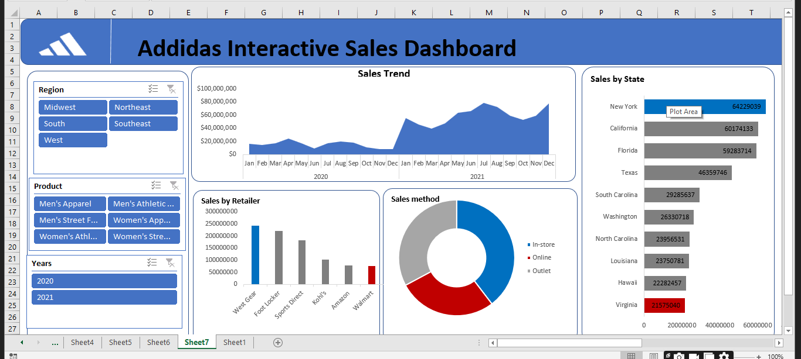

# Addidas Interactive Sales-Dashboard

This dataset contains record of Addidas Company sales in the year 2020 and 2021. Addidas ia a German multinationalcorporation founded and headquartered in Herzogenaurach, Bavaria that designs and manufacture shoes, clothing and accessories. It has Several retailers and distributors all over the world. 

In this analyis, we want to see the sales performance over the years and by diffent retailers. So I generated some Insights which includes,
- Sales trend by month
- Top 10 States by month
- Sales by retailers
- Sales method, 
and I included Slicers to help us know the performance per Region, for each year and for each product
